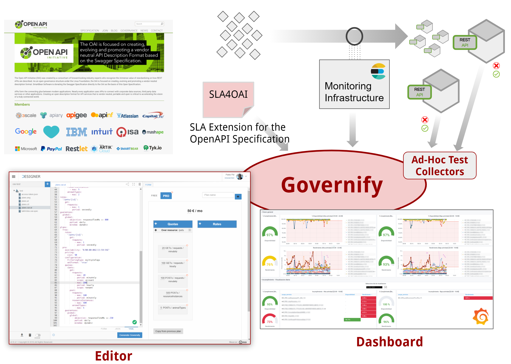

Nowadays, APIs are considered new business products and an increasing number of organizations are publicly exposing their APIs as a way to create new business opportunities in this so-called API Economy. In such a context, defining business models and pricing plans with API limitations, such as quotas or rates, are becoming crucial activities that typically conform a Customer Agreement that include specific expectation over the Service Level that will be provided. 

In this context, organizations face the challenge to assess whether a given API is behaving as expected in order avoid a potential violation of the Service Level stablished with their users. 

From an implementation standpoint, in the current technological landscape, RESTFul pradaigm has become the norm to design the APIs and the [Open API Specification](https://github.com/OAI/OpenAPI-Specification) (OAS),the standard the facto in order to describe them. 

Governify allows the creation of governace platforms to monitor and audit SLAs for APIs by means of different components that can be integrated in multiple scenarios. 

 

As shown in the figure, Governify provides support to API governance in two different directions: (i) to integrate [SLA4OAI](https://sla4oai.specs.governify.io/), an extension for OAS to design SLAs allowing the definition of quotas or rates; and (ii) to integrate with custom tests or existing monitoring infrastructures based on ElasticSearch to gather the real-time metrics on the usage of the APIs. Based on those elements it provide strategic dashboards to assess if the SLAs are meet for each of the different APIs. 
 
