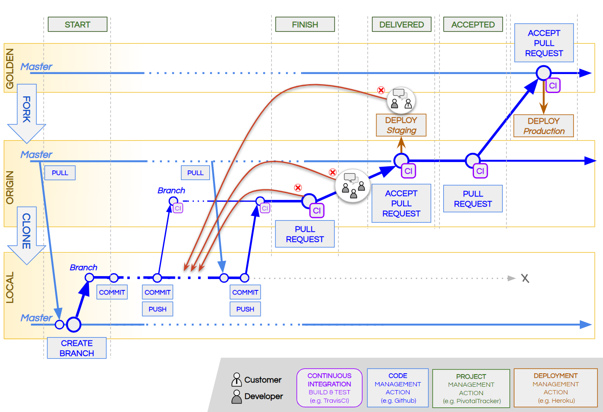
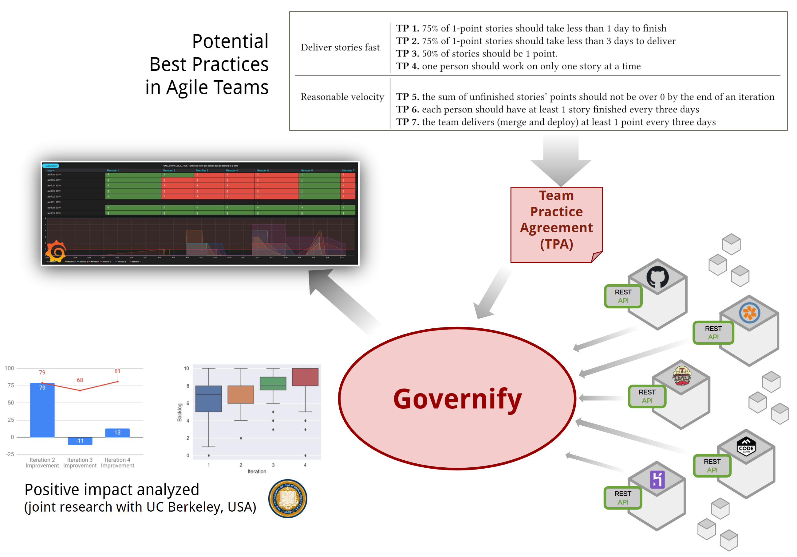

Agile software development is becoming a prominent philosophy amongst the software industry. This philosophy involves the coordination of a team to follow a given workflow that is usually supported by multiple tools and grounded on specific good practices. 

A typical workflow is shown in the following figure where different teams contribute individually to a big repository, containing the actual product with the integrated features.
 

In this particular set of tools, Pivotal Tracker allows users to manage tasks and GitHub can be used to manage the code using git control version system; Travis CI helps running the tests or lint tools to check that everything is correct before accepting any PR; and Heroku can also be used to automatically deploy when pushing to certain branches.

In spite there exists multiple tools to gather metrics from specific tools, it could be a challenge to analyze if a given teams is fwollowing the given process approprietly since it involve the correlation of actions in multiple tools. As an example, in our scenario the *Branch creation* action in Github should be correlated with the *Start story* action in pivotal. 

In this context, Governify can help to build audit platforms for these agile teams by defining the Team Practice Agreement that will define in an explicit way a set of goals that assess if the workflow is being follwod properly.

 

As shown in the figure, Governify gather metrics from the different tools involved in the development process in order to create customized visual dashboards that help the team to  audit the goals defined in the Team Practice Agreement. This capabilities [has been studied in an academic environment](http://doi.org/10.1145/3338906.3341181) showing a possitive outcome in the team performance. 
