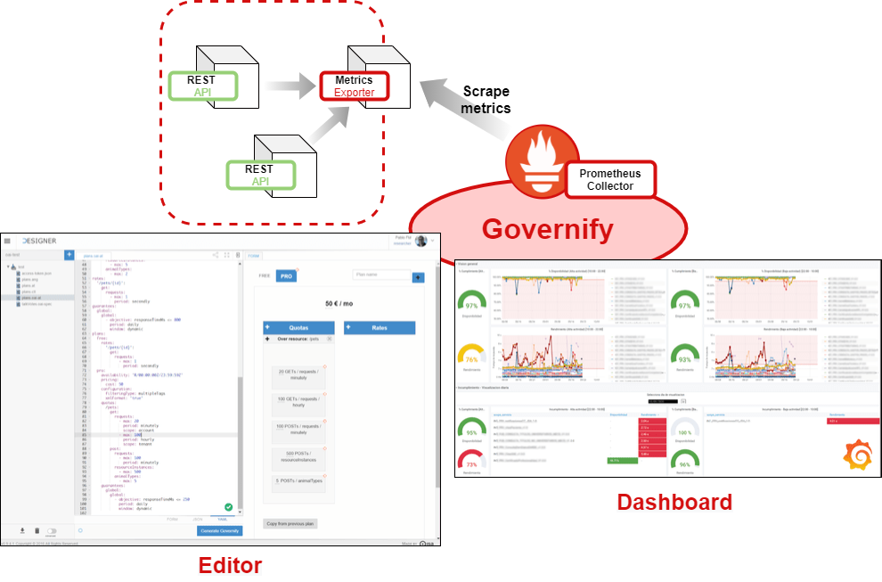

Infrastructure monitoring is essential when it comes to cloud based software, platforms and infrastructures. Any software providing service to end users should be regulated by an SLA that defines the metrics and guarantees the service is committed to meet, and here is where Governify takes action.

As shown in the figure, Governify provides support to distributed & non-distributed cloud-based applications through Prometheus. It collects the exporter metrics through Prometheus scraping and then process them to calculate guarantees.  Based on those elements it provide strategic dashboards to assess if the SLAs are meet for each of the different Infrastructures.