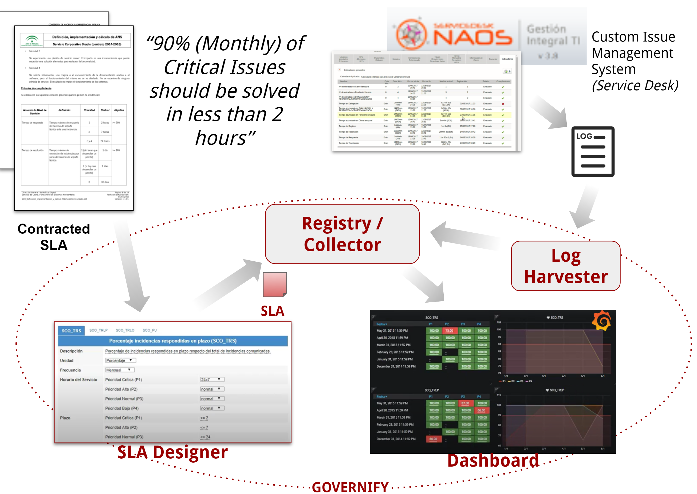

IT support is a key service in mid-large organization and it is frequently oursourced to third-party providers. In general, to assess its quality and drive the strategic decissions over it an explict Service Level Agreement is typically stablished.

 

As shown in the figure, Governify can be used to build governance platforms that streamline the Service Level Agreement to generate a visual dashboard that provides insights on the actual performance of the Support Team.The contracted SLA can be deployed directly to the system in the iAgree Model or custom SLA Designers can be made to allow non-technical people to design / update SLA easyly. In order to gather evidences, it can be connect with the Issue Management System used in the organization to harvest their logs in a non-intrusive way. 
