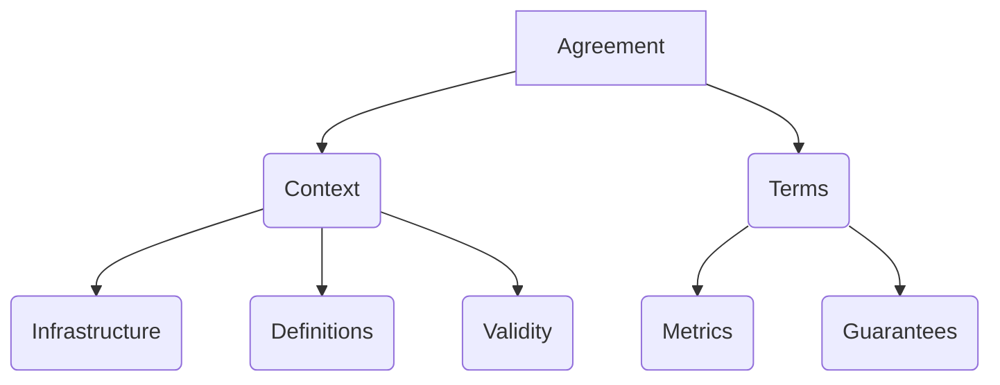

## Introduction
An agreement is defined as a JSON or YAML document that contains the all the information to model, measure and audit one or more proccesses or information related with online services.
The goal of this file is to contain enough information to retrieve data from the services and measure that the guarantees specified in the agreement are being followed.

## General Structure


## Creating a new agreement
We can start a new agreement with the following template and fill all the required data to create one new custom agreement.
```json
{
    "id": "Governify Agreement Template",
    "version": "1.0.0",
    "type": "agreement",
    "context": {
        "validity": {
            "initial": "2020-01-01",
            "timeZone": "America/Los_Angeles"
        },
        "infrastructure": {
        },
        "definitions": {
            "schemas": {},
            "scopes": {
            },
            "collectors": {
            },
            "dashboards": {
            }
        }
    },
    "terms": {
        "metrics": {
        },
        "guarantees": [
        ]
    }
}
```

### Context
The context contains the information related about the services for which the data is being extracted and aditional information about the agreement, such as initial/end vality date, time zone, etc.

#### Validity
The context should specify the validity of the agreement with an initial date and the TimeZone where is being applied. (This timezone is used for metrics and guarantees where the date is a condition factor)
Example:
```json
"validity": {
            "initial": "2020-01-01",
            "timeZone": "America/Los_Angeles"
        }
```

A complete definition and object model can be found in the Syntax section, [here](/customization/agreement_modeling/syntax#contextobject).

#### Infrastructure
Contains the information about which services should be used to compute the metrics.

In order to retrieve the data and communicate to the different microservices of the Governify ecosystem, the URLs where each component will be deployed should be specified. This should be done in the infrastructure object, as the following example:
```json
   "infrastructure": {
            "registry": "http://localhost:8081/api/v6",
            "reporter": "http://reporter.bluejay.governify.io/api/v4",
            "render": "https://ui.bluejay.governify.io/render?model=https://registry.bluejay.governify.io/api/v6/agreements/tpa-1010101010&view=/renders/tpa/default.html&ctrl=/renders/tpa/default.js",
            "dashboard": "http://dashboard.bluejay.governify.io",
            "scopeManager": "https://sm.bluejay.governify.io/api/v1"
        }
```

#### Definitions
The most important part in the definitions is the scope. The scope defines for which service/person/process applies the metric.
If we want to measure a company, we can have for example 3 scopes.
- Project
- Team
- Member
This scope are shared with the metric at the time of computing the metric, so, if we want to calculate for example one metric for all the projects we only have to specify:
`project: *`

Scope examples from Team Practice Agreement:
```json
"scopes": {
                "development": {
                    "project": {
                        "name": "Project",
                        "description": "Project",
                        "type": "string",
                        "default": "1010101010"
                    },
                    "class": {
                        "name": "Class",
                        "description": "Group some projects",
                        "type": "string",
                        "default": "2020202020"
                    }
                }
            }
```

In the definitions object, the services used for collecting information should be specified, in order to be able to compute the metrics values.
For example, this is the specification for the event collector in a Team Practices agreement.
```json
"computers": {
                "eventcomputer": {
                    "url": "http://event.collector.bluejay.governify.io",
                    "endpoint": "/computations",
                    "apiVersion": "2",
                    "config": {
                        "scopeManager": "http://sm.bluejay.governify.io/api/v1/scopes/development"
                    }
                }
            }
```

And finally, to be able to visualize all the data from the guarantees and metrics specified, at least one dashboard must be specified.
You can see all the dashboard configuration in the [Dashboard Modeling](/customization/Dashboards) section.
One simple dashboard configuration can be:
```json
"dashboards": {
                "team-dashboard":{
                    "default": true,
                    "overlay": "/blocks/overlay.js",
                    "base": "/blocks/base.json",
                    "modifier": "/blocks/modifier.js",
                    "config": {
                        "blocks": [
                            {
                                "type": "time-graph",
                                "guarantee": "NUMBER_MASTER_PR_MERGE_WEEKLY_OVER_1_OR_EQUAL",
                                "config": {
                                }
                            }
                        ]
                    }
                }
            }
```

### Terms
The agreement terms are composed by two parts; metrics, and guarantees.
A complete definition and object model can be found in the Syntax section, [here](/customization/agreement_modeling/syntax/#termsobject).

#### Metrics
Every metric in the agreement contains all the necessary information to retrieve specific data from the services and get a final value (Boolean, Integer, String, etc.) from this data.
The metric configuration is dependant of the collector used.
This is an example from a Team Practice agreement using the Event Collector.
```json
"PERCENTAGE_OPENPR_FINISHEDSTORIES_BIND": {
                "collector": {
                    "$ref": "#/context/definitions/collectors/eventcollector"
                },
                "measure": {
                    "computing": "actual",
                    "element": {
                        "percentage": {
                            "related": {
                                "github": {
                                    "allPR": {
                                        "head": {
                                            "ref": "#CONTAINS(primary_resources.0.id)#"
                                        }
                                    }
                                },
                                "window": 86400
                            }
                        }
                    },
                    "event": {
                        "pivotal": {
                            "activity": {
                                "highlight": "finished"
                            }
                        }
                    },
                    "scope": {
                        "$ref": "#/context/definitions/scopes/development"
                    }
                }
            }
```
You can see a complete guide about metric modelling in the [Metrics section](/metrics).

#### Guarantees
The guarantees specify the quality or performance that the metrics should have. 
The objective is a formula that can be composed from one or more metrics.
The window object refers to the calculation timing, where the period is used for how the period of time are splitted in time. For example for a daily period there will be one data point for each day, and the metric is calculated from all the data from that day.
This is an example using the metric from the previous example:

```json
{
                "id": "75_PERCENT_NEWBRANCH_STARTEDSTORIES_WITHIN_A_DAY_BIND",
                "description": "At least 75% of started stories must match a creation of a branch within a day.",
                "scope": {
                    "$ref": "#/context/definitions/scopes/development"
                },
                "of": [
                    {
                        "scope": {
                            "project": "1010101010"
                        },
                        "objective": "PERCENTAGE_NEWBRANCH_STARTEDSTORIES_BIND >= 75",
                        "with": {
                            "PERCENTAGE_NEWBRANCH_STARTEDSTORIES_BIND": {}
                        },
                        "window": {
                            "type": "static",
                            "period": "daily",
                            "initial": "2018-01-01"
                        }
                    }
                ]
}
```

You can see a complete guide about guarantees modelling in the [Guarantees section](/guarantees).