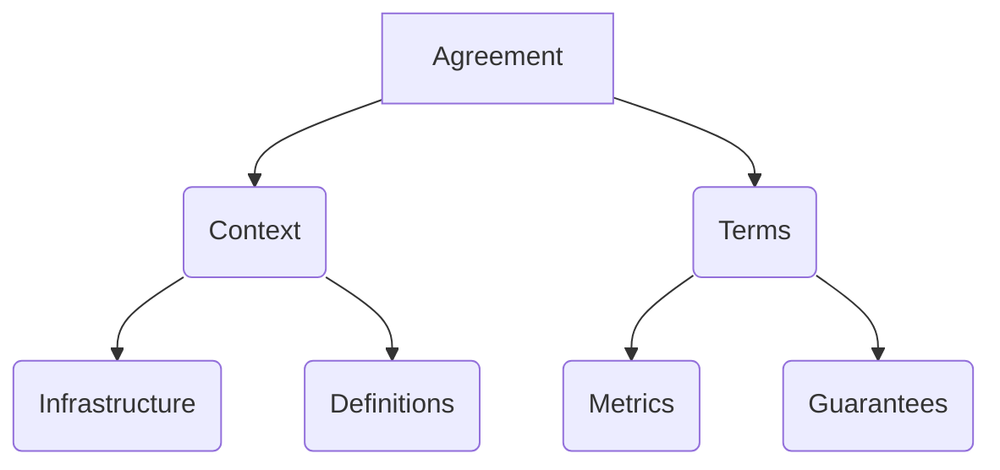

## Introduction
An agreement is defined as a JSON or YAML document that contains the all the information to model, measure and audit one or more proccesses or information related with online services.
The goal of this file is to contain enough information to retrieve data from the services and measure that the guarantees specified in the agreement are being followed.

## General Structure

### Context
The context contains the information related about the services for which the data is being extracted and aditional information about the agreement, such as initial/end vality date, time zone, etc.
A complete definition and object model can be found in the Syntax section, [here](/customization/agreement_modeling/syntax#contextobject).

#### Infrastructure
Contains the information about which services should be used to compute the metrics.

#### Definitions
The most important part in the definitions is the scope. The scope defines for which service/person/process applies the metric.
If we want to measure a company, we can have for example 3 scopes.
- Project
- Team
- Member
This scope are shared with the metric at the time of computing the metric, so, if we want to calculate for example one metric for all the projects we only have to specify:
`project: *`

### Terms
The agreement terms are composed by two parts.
A complete definition and object model can be found in the Syntax section, [here](/customization/agreement_modeling/syntax/#termsobject).

#### Metrics
Every metric in the agreement contains all the necessary information to retrieve specific data from the services and get a final value (Boolean, Integer, String, etc.) from this data.
#### Guarantees
The guarantees specify the quality or performance that the metrics should have. A guarantee is a formula that can be composed from one or more metrics. For example:
`TIMEOUTS / REQUEST > 0.95`
