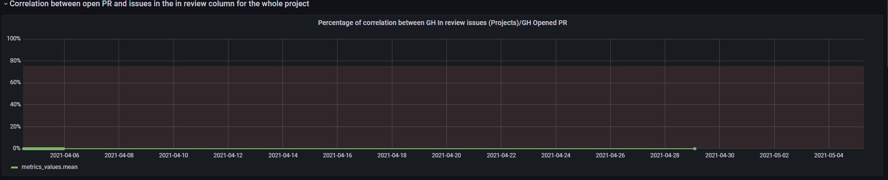
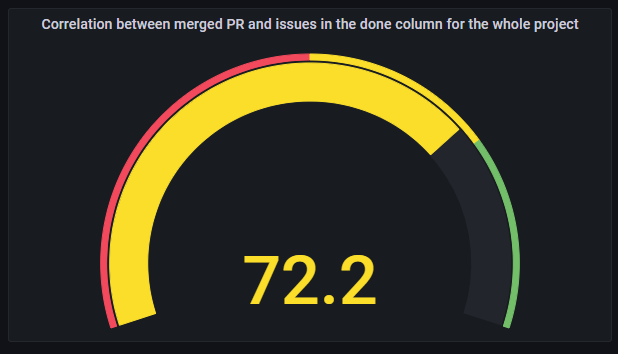
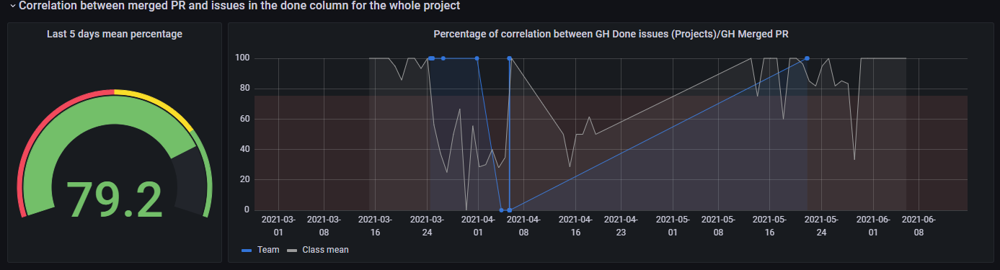
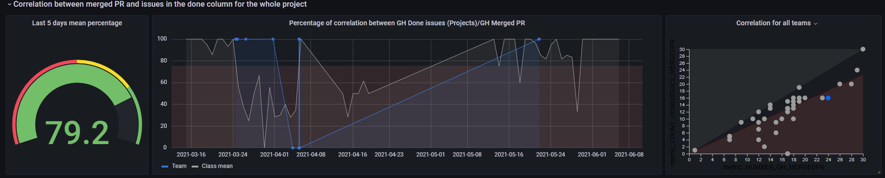
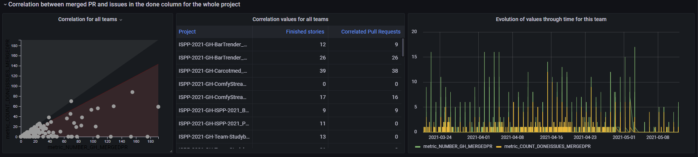
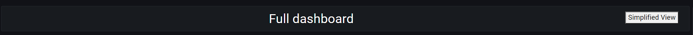
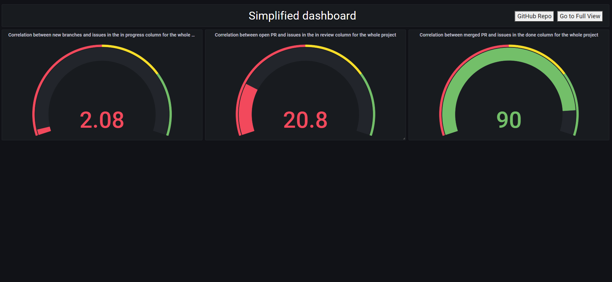
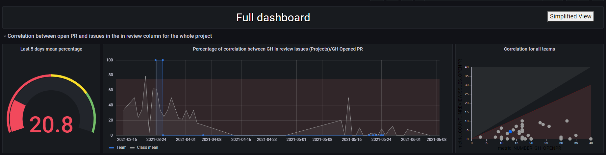
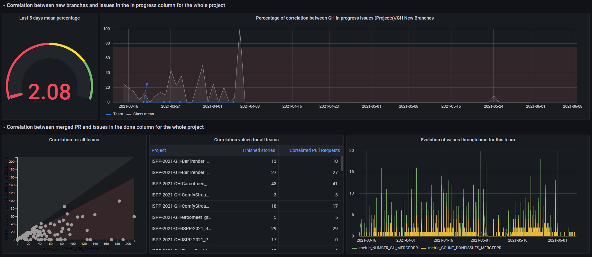

## Dashboard creation

In Governify ecosystem, all the data calculated from agreement can be viewed from Dashboards component.
Dashboards are the way to represent the adherence to the agreement visually.
To create a new dashboard you only have to create one new item in the dashboards section of the agreement (agreement.context.definitions.dashboards)

There are two ways of creating dashboards in Governify.

### 1st. Custom Grafana dashboard
The custom dashboard are composed by three files. This three file are specified in the dashboard section:
```json
    "dashboards": {
        "class-dashboard": {
            "overlay": "/general-class/overlay.js",
            "base": "/general-class/base.json",
            "modifier": "/general-class/modifier.js",
            "modifierPipe":{
                "1":"/general-class/modifier2.js",
                "2":"/general-class/modifier3.js"
            }
        }
    }
```
- **Base.json:** 
    Is the JSON Dashboard file that represent a Grafana Dashboard. You can create a Dashboard from Grafana interface, and with the Dashboard extract the JSON file the following way:
    

    

    And finally copy the code and save it in a JSON file.

- **Modifier.js:** This file must contain a function called modifyJSON, that will be called before sending the JSON dashboard to Grafana to represent it. If you want to modify the base Dashboard with any information from the agreement, you can do it here.
The function modifyJSON receives 3 parameters:
    - JsonDashboard
    - Agreement
    - DashboardName

Example function:
```js
function modifyJSON(jsonDashboard, agreement, dashboardName){
  let modifiedDashboard = {...jsonDashboard};
  return modifiedDashboard;
}
  ```

- **ModifierPipe:** (_optional_) In addition to the modifier option,  modifierPipe allow the integration of a secuencial list of modifier to personalize the base.json in a more readable way. The modifier structure is the same as previously seen and the order of execution is defined with the numerical key in the object.

- **Overlay.js:** This javascript file runs in the client browser when the dashboard is loaded. Can be used to modify Grafana UI or information.

### 2nd. Dashboard by blocks
With this way you only have to define the type of graphs you want for every guarantee you want to represent.
First set the overlay as in the example.
After this, define one block in the config section for every guarantee you want to represent, with the following parameters:
- type: Type of graph.
- guarantee: Guarantee to represent in this block
- config: Depends on each type.

Dashboard block example:
```json
  "dashboards": {
                "class-dashboard":{ //ID of your dashboard
                    "overlay": "/blocks/overlay.js",
                    "config": {
                        "configDashboard":true, //activate the blocks option
                        "blocks": { //list of block declared
                            "1": { // order for the later display
                                "type": "time-graph",
                                "guarantee": "Guarantee_1",
                                "config": {
                                    "time-graph-title": "Graph title"
                                }
                            },
                            "2": {
                                "type": "gauge-time",
                                "guarantee":"Guarantee_2"
                            }
                        }
                    }
                }
```
#### Blocks Types
Every type of block have the option _"time-graph-title"_ to define its title as seen in the example except for dividers blocks.
- **time-graph**: 
    This block represents percentage data over time along with the individual points in a list.
    


- **time-graph2**: 
    Like the previous one, it shows the points of a time series of percentages but without the list of points.
    

- **gauge**: 
    Simple gauge block showing the percentage average of a given guarantee
    

- **gauge-time**: 
    This block adds a visualisation over time to the previous gauge block, allowing you to observe the evolution 
    

- **gauge-time-correlation**: 
    Block for guarantees with more than one metric allows us to visualise the level of agreement that our particular group is reaching together with a relationship with respect to the rest of the groups in the scope.
    Needed extra config: 
    ```json
        "config":{
            "x-axis-metric":"x_Metric",
            "y-axis-metric":"y_Metric"
        }
    ```
    

All of the above blocks have the alternative _"-notZero"(e.g. time-graph-notZero)_ which removes null points from a metric. These alternatives are recommended for the implementation of dashboards in bluejay due to the large number of null data causing poor representation of averages and graphs. They need the extra configuration:
```json
        "config":{
             "not-zero-metric":"notZero_Metric"
        }
```
- **correlated**: 
    With the correlated block, which is specific to bluejay, we obtain the comparison of 2 metrics of the same warranty, first in a visual comparison with the rest of the classes in the scope along with the list of points and then a comparison of these 2 metrics over time for the group in question.
    Needed extra config: 
    ```json
        "config":{
            "x-axis-metric":"x_Metric",
            "y-axis-metric":"y_Metric",
            "not-zero-metric":"notZero_Metric"
        }
    ```
    


- **divider-changer**: 
    This block allows the organisation and navigation between different dashboards specified for a same agreement
    Needed extra config: 
    ```json
        "config":{
            "title":"Full Dashboard", //main title for the header
            "button-text":"Simplified view", 
            "old-view":"full", // actual dashboard name
            "new-view":"general" // dashboard name we want to go
        }
    ```
    

- **divider-changer-github**: 
    Implements the previous block along with the option to navigate to the github repository of the group.
    Needed extra config: 
    ```json
        "config":{
            "title":"Simplified Dashboard", //main title for the header
            "button-text":"Go to full view",
            "old-view":"general", // actual dashboard name
            "new-view":"full" // dashboard name we want to go
        }
    ```
    


#### Full block Example
In this section we will see an example of input and output using the block creation option using the bluejay infrastructure so we will make use of the notZero version of the blocks to better represent the data.

- **TPA Example**:
    First we will see an almost complete example of a tpa used for this project where we will hide part of the metrics acquisition configuration to reduce the size of the representation.

    In this dashboard we will declare 2 dashboards for the guarantees _CORRELATION_INPROGRESSISSUES_NEWBRANCH_, _CORRELATION_INREVIEWISSUES_OPENPR_ and _CORRELATION_DONEISSUES_MERGEDPR_, the first one simplified where we will represent the averages in simple gauge type graphs and the second one more detailed where we will show different graphs, one a bit simpler where we will only see the evolution of the measure and the other 2 more complex where we will see a comparison with the rest of the members of the PSG2 scope.

    ```json
    {
        "id": "tpa-1010101010",
        "version": "1.0.0",
        "type": "agreement",
        "context": {
            "validity": {
                "initial": "2017-10-15",
                "timeZone": "America/Los_Angeles"
            },
            "definitions": {
                ...
                "dashboards": {
                    "main": { // Here we define the first dashboard simplified
                        "overlay": "",
                        "base": "",
                        "modifier": "",
                        "config": {
                            "configDashboard": true,
                            "blocks": {
                                "1": {
                                    "type": "divider-changer-github",
                                    "config": {
                                        "title": "Simplified dashboard",
                                        "button-text": "Go to Full View",
                                        "old-view": "main",
                                        "new-view": "complete"
                                    }
                                },
                                "2": {
                                    "type": "gauge-notZero",
                                    "guarantee": "CORRELATION_INPROGRESSISSUES_NEWBRANCH",
                                    "config": {
                                        "not-zero-metric": "metric_NUMBER_GH_NEWBRANCH"
                                    }
                                },
                                "3": {
                                    "type": "gauge-notZero",
                                    "guarantee": "CORRELATION_INREVIEWISSUES_OPENPR",
                                    "config": {
                                        "not-zero-metric": "metric_NUMBER_GH_OPENPR"
                                    }
                                },
                                "4": {
                                    "type": "gauge-notZero",
                                    "guarantee": "CORRELATION_DONEISSUES_MERGEDPR",
                                    "config": {
                                        "not-zero-metric": "metric_NUMBER_GH_MERGEDPR"
                                    }
                                }
                            }
                        }
                    },
                    "complete": { // Here start the detailed dashboard
                        "overlay": "",
                        "base": "",
                        "modifier": "",
                        "config": {
                            "configDashboard": true,
                            "blocks": {
                                "1": {
                                    "type": "divider-changer",
                                    "config": {
                                        "title": "Full dashboard",
                                        "button-text": "Simplified View",
                                        "old-view": "complete",
                                        "new-view": "main"
                                    }
                                },
                                "2":{
                                    "type": "gauge-time-correlation-notZero",
                                    "guarantee": "CORRELATION_INREVIEWISSUES_OPENPR",
                                    "config": {
                                        "x-axis-metric": "metric_NUMBER_GH_OPENPR",
                                        "y-axis-metric": "metric_COUNT_INREVIEWISSUES_OPENPR",
                                        "not-zero-metric": "metric_NUMBER_GH_OPENPR",
                                        "time-graph-title": "Percentage of correlation between GH In review issues (Projects)/GH Opened PR",
                                        "scope-class":"PSG2-2021"
                                    }
                                },
                                "3":{
                                    "type": "gauge-time-notZero",
                                    "guarantee": "CORRELATION_INPROGRESSISSUES_NEWBRANCH",
                                    "config": {
                                        "not-zero-metric": "metric_NUMBER_GH_NEWBRANCH",
                                        "time-graph-title": "Percentage of correlation between GH In progress issues (Projects)/GH New Branches",
                                        "scope-class":"PSG2-2021"
                                    }
                                },
                                "4":{
                                    "type": "correlated",
                                    "guarantee": "CORRELATION_DONEISSUES_MERGEDPR",
                                    "config": {
                                        "x-axis-metric": "metric_NUMBER_GH_MERGEDPR",
                                        "y-axis-metric": "metric_COUNT_DONEISSUES_MERGEDPR",
                                        "not-zero-metric": "metric_NUMBER_GH_MERGEDPR",
                                        "time-graph-title": "Percentage of correlation between GH Done issues (Projects)/GH Merged PR",
                                        "scope-class":"PSG2-2021"
                                    }
                                }
                            }
                        }
                    }
                }
            }
        },
        "terms": {
            "metrics": {
                "NUMBER_GH_NEWBRANCH": {
                    ...
                },
                "NUMBER_GH_OPENPR": {
                    ...
                },
                "NUMBER_GH_MERGEDPR": {
                    ...
                },
                "PERCENTAGE_INPROGRESSISSUES_NEWBRANCH": {
                    ...
                },
                "COUNT_INPROGRESSISSUES_NEWBRANCH": {
                    ...
                },
                "PERCENTAGE_INREVIEWISSUES_OPENPR": {
                    ...
                },
                "COUNT_INREVIEWISSUES_OPENPR": {
                    ...
                },
                "PERCENTAGE_DONEISSUES_MERGEDPR": {
                    ...
                },
                "COUNT_DONEISSUES_MERGEDPR": {
                    ...
                }
            },
            "guarantees": [
                {
                    "id": "CORRELATION_INPROGRESSISSUES_NEWBRANCH",
                    "notes": "#### Description\r\n```\r\nTP-1: At least 75% of in progress issues must match creation of a branch.",
                    "description": "Correlation between new branches and issues in the in progress column for the whole project",
                    "scope": {
                        "$ref": "#/context/definitions/scopes/development"
                    },
                    "notifications": {
                        "grafana": {
                            "slack": {}
                        }
                    },
                    "of": [
                        {
                            "scope": {
                                "project": "1010101010"
                            },
                            "objective": "PERCENTAGE_INPROGRESSISSUES_NEWBRANCH >= 75",
                            "with": {
                                "PERCENTAGE_INPROGRESSISSUES_NEWBRANCH": {},
                                "COUNT_INPROGRESSISSUES_NEWBRANCH": {},
                                "NUMBER_GH_NEWBRANCH": {}
                            },
                            "window": {
                                "type": "static",
                                "period": "daily",
                                "initial": "2018-01-01"
                            }
                        }
                    ]
                },
                {
                    "id": "CORRELATION_INREVIEWISSUES_OPENPR",
                    "notes": "#### Description\r\n```\r\nTP-1: At least 75% of in review issues must match creation of a PR.",
                    "description": "Correlation between open PR and issues in the in review column for the whole project",
                    "scope": {
                        "$ref": "#/context/definitions/scopes/development"
                    },
                    "notifications": {
                        "grafana": {
                            "slack": {}
                        }
                    },
                    "of": [
                        {
                            "scope": {
                                "project": "1010101010"
                            },
                            "objective": "PERCENTAGE_INREVIEWISSUES_OPENPR >= 75",
                            "with": {
                                "PERCENTAGE_INREVIEWISSUES_OPENPR": {},
                                "COUNT_INREVIEWISSUES_OPENPR": {},
                                "NUMBER_GH_OPENPR": {}
                            },
                            "window": {
                                "type": "static",
                                "period": "daily",
                                "initial": "2018-01-01"
                            }
                        }
                    ]
                },
                {
                    "id": "CORRELATION_DONEISSUES_MERGEDPR",
                    "notes": "#### Description\r\n```\r\nTP-1: At least 75% of done issues must match the merge of a PR.",
                    "description": "Correlation between merged PR and issues in the done column for the whole project",
                    "scope": {
                        "$ref": "#/context/definitions/scopes/development"
                    },
                    "notifications": {
                        "grafana": {
                            "slack": {}
                        }
                    },
                    "of": [
                        {
                            "scope": {
                                "project": "1010101010"
                            },
                            "objective": "PERCENTAGE_DONEISSUES_MERGEDPR >= 75",
                            "with": {
                                "PERCENTAGE_DONEISSUES_MERGEDPR": {},
                                "COUNT_DONEISSUES_MERGEDPR": {},
                                "NUMBER_GH_MERGEDPR": {}
                            },
                            "window": {
                                "type": "static",
                                "period": "daily",
                                "initial": "2018-01-01"
                            }
                        }
                    ]
                }
            ]
        }
    }

    ```

- **Main Dashboard**:
    
- **Detailed Dashboard**
    
    