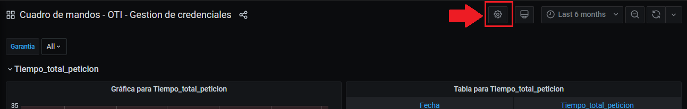
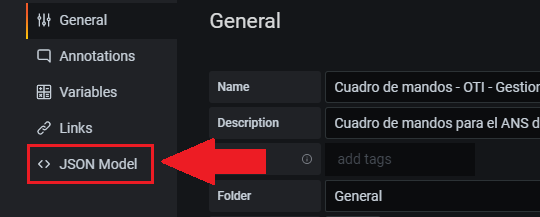

### Dashboard creation

In Governify ecosystem, all the data calculated from agreement can be viewed from Dashboards component.
Dashboards are the way to represent the adherence to the agreement visually.
To create a new dashboard you only have to create one new item in the dashboards section of the agreement (agreement.context.definitions.dashboards)

There are two ways of creating dashboards in Governify.

#### 1st. Predefined graphs blocks (Easy)
With this way you only have to define the type of graphs you want for every guarantee you want to represent.
First set the overlay, base and modifier files as in the example.
After this, define one block in the config section for every guarantee you want to represent, with the following parameters:
- type: Type of graph. (time-graph / correlated)
- order: Order for the block in the Dashboard
- guarantee: Guarantee to represent in this block
- config: Depends on each type.

Dashboard block example:
```json
  "dashboards": {
                "team-dashboard":{ //ID of your dashboard
                    "default": true, //Default dashboard for the agreement
                    "overlay": "/blocks/overlay.js",
                    "base": "/blocks/base.json",
                    "modifier": "/blocks/modifier.js",
                    "config": {
                        "blocks": [
                            {
                                "type": "correlated",
                                "order": 3,
                                "guarantee": "STDEV_GITHUB_MERGE_PR_WEEKLY_UNDER_1",
                                "config": {
                                    "x-axis-metric": "metric1",
                                    "y-axis-metric": "metric2"
                                }
                            },
                            {
                                "type": "time-graph",
                                "guarantee": "75_PERCENT_MASTER_PR_MERGE_DELVR_STORIES_WITHIN_A_DAY",
                                "config": {

                                }
                            }
                        ]
                    }
                }
```


#### 2st. Custom Grafana dashboard
The custom dashboard are composed by three files. This three file are specified in the dashboard section:
```json
    "dashboards": {
        "class-dashboard": {
        "overlay": "/general-class/overlay.js",
        "base": "/general-class/base.json",
        "modifier": "/general-class/modifier.js"
        }
    }
```
- **Base.json:** Is the JSON Dashboard file that represent a Grafana Dashboard. You can create a Dashboard from Grafana interface, and with the Dashboard extract the JSON file the following way:


    

    And finally copy the code and save it in a JSON file.

- **Modifier.js:** This file must contain a function called modifyJSON, that will be called before sending the JSON dashboard to Grafana to represent it. If you want to modify the base Dashboard with any information from the agreement, you can do it here.
The function modifyJSON receives 3 parameters:
    - JsonDashboard
    - Agreement
    - DashboardName

Example function:
```js
function modifyJSON(jsonDashboard, agreement, dashboardName){\
  let modifiedDashboard = {...jsonDashboard};
  return modifiedDashboard;
}
  ```

- **Overlay.js:** This javascript file runs in the client browser when the dashboard is loaded. Can be used to modify Grafana UI or information.