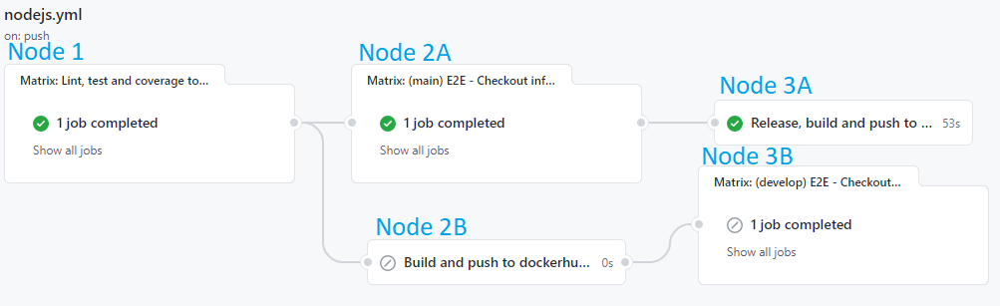

# Introduction
CI/CD is a series of interconnected processes that empower developers to build quality software through well-aligned and automated development, testing, delivery, and deployment. Together, these practices ensure better collaboration and greater efficiency for DevOps teams throughout the software development life cycle. GitHub Actions, thanks to being built in to GitHub, has made integrating with different services much easier and helps to have all the things in one place.

# Microservices CI/CD
At this moment, the different component repositories are configured with the same pipeline to test, lint and build the different docker images used in the deployments. Some of them my skip a step (e.g. testing if the microservice has not implemented them yet) but they all are composed of the same nodes. 

In this image, the nodes have been numbered and differenciated one branch to the other (A and B). One of these CI/CD branches will be executed depending if the push/merge PR is done to the repository's main branch or the develop branch.

## Node 1 (main, develop) - Lint, test and coverage
This node will execute 3 tasks:
 - Lint - It will check all the code is properly linted as specified in the package.json
 - Test - It will run unitary tests to check no functionallity was broken in the commit
 - Coverage - The coverage report obtained is sent to coveralls to update the badge

If this step is successful, the pipeline will flow to the next node.

## Node 2B (develop) - Build and push to Dockerhub
If the push has been made to the develop branch, this node will execute. It will use DockerHub credentials (stored on GitHub secrets) to build the image based on the Dockerfile and push it to dockerhub. The new image's tag will be `develop`. If this step is successful, the node 3B will be executed.

## Node 3B (develop) - E2E tests
On Bluejay's infrastructure, a set of tests have been made to ensure proper functioning of the system (To know more about this, check out the last section of this page). Using the new image built in the node 2B and the other develop images from the different microservices, the CI will check out the whole infrastructure repository, deploy all the containers and check nothing was broken by passing some tests.

## Node 2A (main) - E2E tests
When something is updated on the main branch, it must be due to a PR merge from the development branch. This step is the exact same as the 3B but if it fails, the next node won't run. This is to ensure the infrastructure is properly working  with the latest image before doing the last step.

## Node 3A (main) - Release, build and push to Dockerhub
This is similar to the node 2B but adds a task. At first, it will use all the commit messages (which should be written using [Conventional Commits](https://www.conventionalcommits.org/en/v1.0.0/)) to create a changelog and adds a new tag and Release of the code in the repository using this changes as the body. It also automatically increases the version number. Then, using this tag, it builds two exact same docker images but one tagged with it and the other with the `latest` tag. Finally, it creates a PR to develop with the changelog and package.json version increase to be accepted and keep it up to date with the main branch.

# E2E tests - Bluejay Infrastructure
On Bluejay's infrastructure repository mocha tests can be found. These are made to check the containers can properly communicate between them and the basic functionallity of Governify is working. They are implemented using Mocha.js and this is a brief overview of what they do:

1. Downloads all the docker images using a docker compose very similar to the docker-compose-local and mounts the system.
2. It inits governify-commons for the tests to be generic and able to communicate with the different APIs and databases.
3. It ensures that the test data is not present in the system by deleting it. This is done to ensure old data is not kept from older runs (it can also be runned locally).
4. An agreement is created and checked.
5. It sends a request to calculate the agreement for a fixed period. All the requests to external APIs are mocked up (The event collector is started as E2E for it to build up all the mockups needed).
6. Influx database is queried to ensure the points have been inserted and the data is correct.
7. Influx test data is deleted as well as the agreement.
8. The system is shutted down.

This E2E tests do not cover the whole infrastructure but it checks that the main components which have the most number of connections are working as they should. It runs on any microservice push or on any push/PR to the main or develop branches this CI also runs.