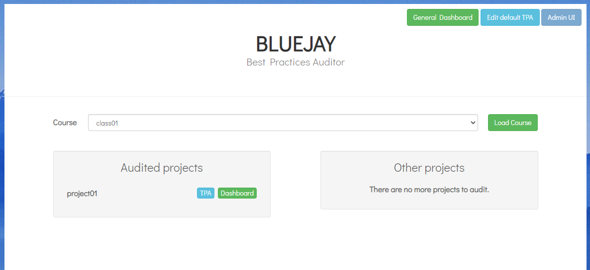
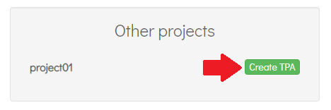
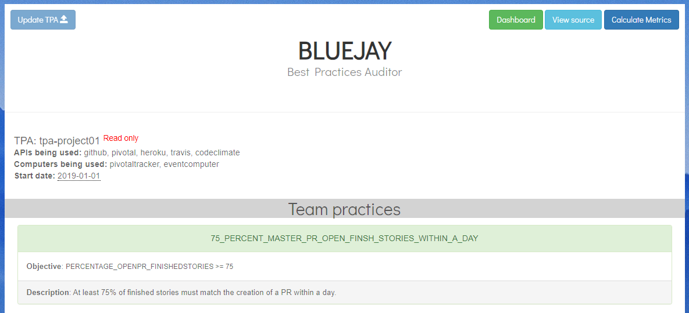
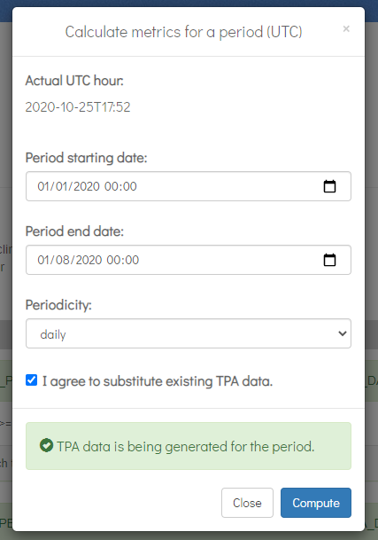
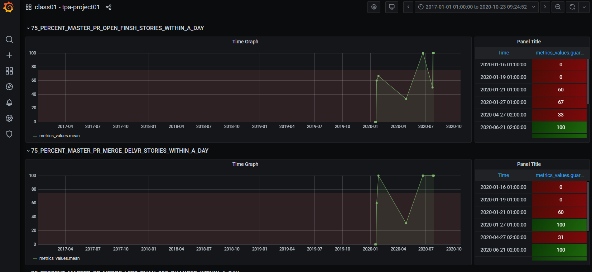

## Auditing agile development «Bluejay» 
### Introduction
Governify platform can be use to model Team Practices in Agile development. We have develop components for collect information from multiple developing tools API such as GitHub, Pivotal Tracker, Heroku, and more.

We call this system **Bluejay**, an open source extensible platform that can connect to multiple tools to support software engineering teams continuous improvement processes.
Bluejay can audit one team, multiples teams or an entire company having diferent *Team Practices*.

You can deploy Bluejay in 10 minutes.
___
### Deploying Bluejay
This guide deploys bluejay with the docker ecosystem and serve it by means of an nginx proxy.

#### Prerequisites
- Linux server with the following installed packages:
   - docker
   - docker-compose 
- A domain with the ability to modify DNS records.
- Ports 80, 443 open on the server. 

#### Infrastructure setup
1. Create the following DNS A records, pointing to your server IP.
- ui.bluejay.*[YourDomain]*
- registry.bluejay.*[YourDomain]*
- reporter.bluejay.*[YourDomain]*
- dashboard.bluejay.*[YourDomain]*
- sm.bluejay.*[YourDomain]*

2. Download latest release of Bluejay Infrastructure repository [Bluejay Infrastructure](https://github.com/governify/bluejay-infrastructure):
```
curl https://github.com/governify/bluejay-infrastructure/archive/1.12.3.zip -LO
 ```

3. Unzip the release
``` 
unzip 1.12.3.zip
cd /bluejay-infrastructure-1.12.3
``` 

4. Open a terminal in the repository folder and execute setup.sh with the following parameters:
```
./setup.sh <.YourDomain> <ServerIP> bluejay
```

5. (Optional) When the setup is done, create the SSL certificates for your deployment using [Lets Encript](https://letsencrypt.org/):
```
  ./init-letsencrypt.sh
```

Governify ecosystem with bluejay services should have been deployed in the system. Following section guide you through the system:

### Quick tour
The main interaface is accesible from ui.bluejay.*[YourDomain]*
The default credentials for this interface is user: admin - password: admin

<Info>This credentials can be changed in the docker-compose.yaml file.</Info>

In this interface you should be able to see a list of all the teams you have in your configuration. By default, it comes with a predefined example project.



To start auditing the example project simply click on the "Create TPA" button right next to the team's name (project01). This will create a simple predefined agreement for that team to start auditting it.



A new tab will open and, once the agreement is created, the TPA view of the project should appear. It contains information about it along the guarantees and metrics in use.



To calculate data for this project, the top-right blue button `Calculate Metrics` has to be clicked and a form will apear.



The dates should be the same as the image in order to appear the correct information and the checkbox has to be accepted. By clicking the `Compute` button the system will start computing and, if everything goes well, after 5-20 seconds, the `TPA data is being generated for the period.` alert message will change to `Points creation ended.`

Clicking the `Dashboard` green button at the top-right corner, a new tab will open. The default username and password are governify-admin and governify-project.

<Info>This credentials can be changed once logged in the bottom left of the Dashboard, section Change password.</Info>

Once logged, the dashboard for the project will be opened where all the audit data can be viewed.



Now is time to configure your own projects in order to audit them.

### Configuration
Bluejay should be able to access team data. To achieve this, the API Keys for each team that will be tracked should be provided.

There are 3 different files inside the cloned folder for configuring the system in order to start using it:
 * /configurations/scope-manager/scopes.json
   * The scope manager is the component serving the information about the projects. This file contains the different tools a team is using as well as information from the members and tokens to access that data.
 * /configurations/scope-manager/authKeys.json
   * As some information given by the ScopeManager might be sensitive, this file contains authorized tokens for other components to obtain the sensitive information.
 * /configurations/collector-events/authKeys.json
   * This file contains the key for accessing the ScopeManager as well as default keys for the different APIs from where the collector will consume data. These will be used if the tokens are not included in the scope.json for a given team. 

#### scope.json
This file contains all the information from the different courses, teams and members to be identified along the different tools. It is organized with a hierarchy as the following:
 * First it has a first array called development which contains the different classes. 
 * Each class has a projects array containing all the projects (teams) inside that course. 
 * Each project has a members array containing all the members inside that project.
 * Each of these objects (course, project, member) follows the same structure:
``` json
{
            "parentId": "parent01",
            "identities": [],
            "credentials": [],
            "childs": []
}
```
Inside each object there is two different arrays:
 * Identities is used to store the information that identifies that object in the different tools. 
 * Credentials have all the tokens needed to obtain information from those tools. 

For example if the object is a project, identities will have information from the different tools and credentials concerning those tools. Their childs are the members so it will have 0 or more member objects inside the members array. 

This is an example scopes.json template file:

``` json
/configurations/scope-manager/scopes.json
{
    "development": [
        {
            "classId": "class01",
            "identities": [],
            "credentials": [],
            "projects": [
                {
                    "projectId": "project01",
                    "identities": [
                        {
                            "source": "github",
                            "repository": "repo01",
                            "repoOwner": "owner01"
                        },
                        {
                            "source": "pivotal",
                            "projectId": 1
                        },
                        {
                            "source": "heroku",
                            "projectId": "id1"
                        },
                        {
                            "source": "travis"
                        },
                        {
                            "source": "codeclimate"
                        }
                    ],
                    "credentials": [
                        {
                          "source": "github",
                          "apiKey": "githubToken"
                        },
                        {
                          "source": "pivotal",
                          "apiKey": "pivotalToken"
                        },
                        {
                          "source": "heroku",
                          "apiKey": "herokuToken"
                        },
                        {
                          "source": "travis",
                          "apiKey": "travisToken"
                        },
                        {
                          "source": "codeclimate",
                          "apiKey": "codeclimateToken"
                        }
                    ],
                    "members": [
                        {
                            "memberId": 1,
                            "identities": [
                                {
                                    "source": "github",
                                    "username": "githubName1"
                                },
                                {
                                    "source": "pivotal",
                                    "username": "pivotalName1"
                                }
                            ],
                            "credentials": []
                        },
                        {
                            "memberId": 2,
                            "identities": [
                                {
                                    "source": "github",
                                    "username": "githubName2"
                                },
                                {
                                    "source": "pivotal",
                                    "username": "pivotalName2"
                                }
                            ],
                            "credentials": []
                        }
                    ]
                }
            ]
        }
    ]
}
```
This file needs to be filled up with the different teams and members for the system to start auditing them. Also any needed credential for each tool has to be inserted. If the tools are public, no token might be needed. In that case, mind the API rate limits. Heroku cannot work without a token. For default keys for not having to fill them in the scopes.json for each project, keep reading.

After modifiying this file, the Scope Manager needs to be restarted for it to serve the new scopes:
```
docker restart bluejay-scopemanager-container
```

#### authKeys.json files
The two authKeys.json files are already preconfigured. In order to connect the collectors and the scope manager, there exist a key that must be the same in order to obtain sensitive information. When running the setup.sh script, these keys are randomly generated so they aren't needed to be changed. 
``` json  
/configurations/scope-manager/authKeys.json
[
    "Cs6bVCTGWLtXA8gr"
]
```
``` json  
/configurations/collector-events/authKeys.json
{
    "scopeManager": "Cs6bVCTGWLtXA8gr",
    "github": "",
    "pivotal": "",
    "heroku": "",
    "travis": "",
    "codeclimate": ""
}
```
If you also want to fill the default keys for the EventCollector to use them in case no key is given in the scopes.json you can do it here. As case examples:
 * It is recommended to use a default key for not exceeding API non authenticated rates even if the projects are public.
 * If multiple teams have a common user with access to all projects, you can fill the /configurations/collector-events/authKeys.json with his keys and thus, having no need to enter any key in the scopes.json file.

 After modifiying this two files, the Scope Manager and the Event Collector need to be restarted for them to serve the new scopes:
```
docker restart bluejay-scopemanager-container bluejay-eventcollector-container
```


### Customization
Bluejay is customizable in every aspect. You can create new agreements, new dashboard and even new interfaces. Check the following sections:
- [Agreement Modeling customization](/customization/agreement_modeling)
- [User Interfaces customization](/customization/user_interfaces)
- [Dashboards customization](/customization/dashboards)