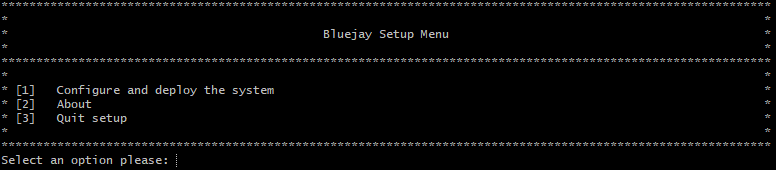
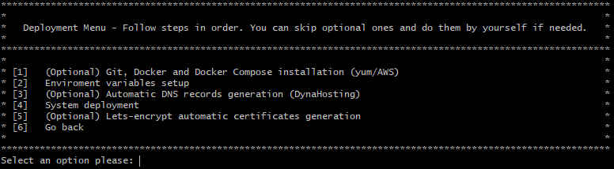
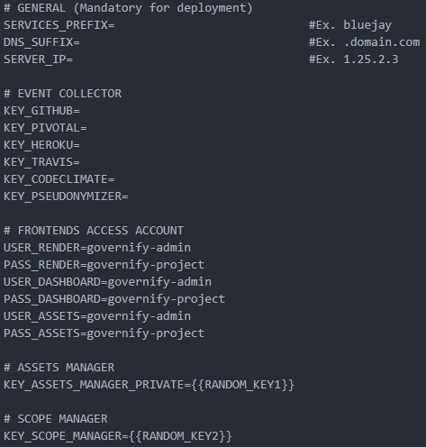

## Auditing agile development «Bluejay» 

<Info>For deploying versions older than 2.0.0, click on this <a href="/quickstart/auditing-agile-1.0">link</a></Info>

### Introduction
Governify platform can be use to model Team Practices in Agile development. We have develop components for collect information from multiple developing tools API such as GitHub, Pivotal Tracker, Heroku, and more.

We call this system **Bluejay**, an open source extensible platform that can connect to multiple tools to support software engineering teams continuous improvement processes.
Bluejay can audit one team, multiples teams or an entire company having diferent *Team Practices*.

You can deploy Bluejay in 5 minutes.
___
### Deploying Bluejay
This guide deploys bluejay with the docker ecosystem and serve it by means of an nginx proxy.

#### Prerequisites
- Linux server with the following installed packages:
   - docker
   - docker-compose (version 1.27 or greater)
- A domain with the ability to modify DNS records.
- Ports 80, 443 open on the server. 

#### Infrastructure setup
1. Create the following DNS A records, pointing to your server IP. If you are deploying locally you can add these to your hosts file pointing to your machine but it only will be accessible by you.
- ui.bluejay.*[YourDomain]*
- registry.bluejay.*[YourDomain]*
- reporter.bluejay.*[YourDomain]*
- dashboard.bluejay.*[YourDomain]*
- scopes.bluejay.*[YourDomain]*
- assets.bluejay.*[YourDomain]*
- director.bluejay.*[YourDomain]*
- join.bluejay.*[YourDomain]*

2. Download latest release of Bluejay Infrastructure repository [Bluejay Infrastructure](https://github.com/governify/bluejay-infrastructure):
```
curl https://github.com/governify/bluejay-infrastructure/archive/2.2.0.zip -LO
 ```

3. Unzip the release
``` 
unzip 2.2.0.zip
cd /bluejay-infrastructure-2.2.0
``` 

4. Edit `.env` located at the root of the folder. This file contains all the environmental variables for the system to work as intended. By now you should at least fill the first three variables concerning the deployment. Bear in mind that both *SERVICES_PREFIX* and *DNS_SUFIX* must start with a dot and end without it.

```
# GENERAL (Mandatory for deployment)
SERVICES_PREFIX=                    # Ex: .bluejay
DNS_SUFFIX=                         # Ex: .bluejay
SERVER_IP=                          # Ex: .bluejay

# Infrastructure config file path. No need to be modified
GOV_INFRASTRUCTURE=http://bluejay-assets-manager/api/v1/public/infrastructure.yaml

# EVENT COLLECTOR
KEY_GITHUB=                         # Token
KEY_PIVOTAL=                        # Token
KEY_HEROKU=                         # Token
KEY_TRAVIS_PUBLIC=                  # Token
KEY_TRAVIS_PRIVATE=                 # Token
KEY_CODECLIMATE=                    # Token
KEY_PSEUDONYMIZER=                  # Token

# FRONTENDS ACCESS ACCOUNT
USER_RENDER=governify-admin         # UI Access user
PASS_RENDER=governify-project       # UI Access pass
USER_ASSETS=governify-admin         # Assets Access user
PASS_ASSETS=governify-project       # Assets Access pass

# ASSETS MANAGER
KEY_ASSETS_MANAGER_PRIVATE={{RANDOM_KEY1}}  # No need to modify

# SCOPE MANAGER
KEY_SCOPE_MANAGER={{RANDOM_KEY2}}           # No need to modify

# COMPOSE CONFIG
COMPOSE_HTTP_TIMEOUT=200                    # No need to modify
```

5. Deploy the system with the following command:
```
./utils/deploy.sh
```

6. (Optional) When the deployment is done, create the SSL certificates for your deployment using [Lets Encript](https://letsencrypt.org/):
```
./utils/init-letsencrypt.sh
```

Governify ecosystem with bluejay services should have been deployed in your machine. The following section will guide you through the system.

<Info>If you prefer, there is also an <a href="#advancedsetup">advanced guide</a> to deploy the system including extra options.</Info>

___

### Quick tour
The main interaface is accesible from ui.bluejay.*[YourDomain]*
The default credentials for this interface are: 
 * User: governify-admin 
 * Password: governify-project

<Info>This credentials can be changed in the .env file.</Info>

In this interface you should be able to see a list of all the teams you have in your configuration. By default, it comes with a predefined example project.


To start auditing the example project simply click on the "Create TPA" button right next to the team's name (project01). This will create a simple predefined agreement for that team to start auditting it.


A new tab will open and, once the agreement is created, the TPA view of the project should appear. It contains information about it along the guarantees and metrics in use.


To calculate data for this project, the top-right blue button `Calculate Metrics` has to be clicked and a form will apear.


The dates should be the same as the image in order to appear the correct information and the checkbox has to be accepted. By clicking the `Compute` button the system will start computing and, if everything goes well, after 5-20 seconds, the `TPA data is being generated for the period.` alert message will change to `Points creation ended.`

Clicking the `Dashboard` green button at the top-right corner, a new tab will open. The default username and password are governify-admin and governify-project.

<Info>This credentials can be changed, once logged, going to the icon in the bottom left part of the Dashboard, clicking on preferences, and accessing the section Change password at the top of the page.</Info>

Once logged, the dashboard for the project will be opened where all the audit data can be viewed.


Now is time to configure your own projects in order to audit them.

___
### Configuration
Bluejay should be able to access team data. To achieve this, the API Keys for each team that will be tracked should be provided.

There are 2 different files inside the cloned folder for configuring the system in order to start using it:
 * /.env
   * This file contains the environment variables to configure the system, including the different API tokens. You can also change here the password to access the UI and the assets manager Theia UI.
 * /assets/private/scope-manager/scopes.json
   * The scope manager is the component serving the information about the projects. This file contains the different tools a team is using as well as information from the members and tokens to access that data.

#### .env
Here are contained all configuaration variables. Enter here your tokens for the different APIs for the Event Collector to use it by default if it is not given for the project in the scope.json file.

#### scope.json
This file contains all the information from the different courses, teams and members to be identified along the different tools. It is organized with a hierarchy as the following:
 * First it has a first array called development which contains the different classes. 
 * Each class has a projects array containing all the projects (teams) inside that course. 
 * Each project has a members array containing all the members inside that project.
 * Each of these objects (course, project, member) follows the same structure:
``` json
{
    "parentId": "parent01",
    "identities": [],
    "credentials": [],
    "childs": []
}
```
Inside each object there is two different arrays:
 * Identities is used to store the information that identifies that object in the different tools. 
 * Credentials have all the tokens needed to obtain information from those tools. 

For example if the object is a project, identities will have information from the different tools and credentials concerning those tools. Their childs are the members so it will have 0 or more member objects inside the members array. 

This is an example scopes.json template file:

``` json
/configurations/scope-manager/scopes.json
{
    "development": [
        {
            "classId": "class01",
            "identities": [],
            "credentials": [],
            "projects": [
                {
                    "projectId": "project01",
                    "identities": [
                        {
                            "source": "github",
                            "repository": "repo01",
                            "repoOwner": "owner01"
                        },
                        {
                            "source": "pivotal",
                            "projectId": 1
                        },
                        {
                            "source": "heroku",
                            "projectId": "id1"
                        },
                        {
                            "source": "travis"
                        },
                        {
                            "source": "codeclimate"
                        }
                    ],
                    "credentials": [
                        {
                          "source": "github",
                          "apiKey": "githubToken"
                        },
                        {
                          "source": "pivotal",
                          "apiKey": "pivotalToken"
                        },
                        {
                          "source": "heroku",
                          "apiKey": "herokuToken"
                        },
                        {
                          "source": "travis",
                          "apiKey": "travisToken"
                        },
                        {
                          "source": "codeclimate",
                          "apiKey": "codeclimateToken"
                        }
                    ],
                    "members": [
                        {
                            "memberId": 1,
                            "identities": [
                                {
                                    "source": "github",
                                    "username": "githubName1"
                                },
                                {
                                    "source": "pivotal",
                                    "username": "pivotalName1"
                                }
                            ],
                            "credentials": []
                        },
                        {
                            "memberId": 2,
                            "identities": [
                                {
                                    "source": "github",
                                    "username": "githubName2"
                                },
                                {
                                    "source": "pivotal",
                                    "username": "pivotalName2"
                                }
                            ],
                            "credentials": []
                        }
                    ]
                }
            ]
        }
    ]
}
```
This file needs to be filled up with the different teams and members for the system to start auditing them. Also any needed credential for each tool has to be inserted. If the tools are public, no token might be needed. In that case, mind the API rate limits. Heroku cannot work without a token. For default keys for not having to fill them in the scopes.json for each project, keep reading.

After modifiying this file, the Scope Manager needs to be restarted for it to serve the new scopes:
```
docker restart bluejay-scope-manager
```

___
### Customization
Bluejay is customizable in every aspect. You can create new agreements and dashboards. Check the following sections:
- [Agreement Modeling customization](/customization/agreement_modeling)
<!-- - [User Interfaces customization](/customization/user_interfaces) -->
- [Dashboards customization](/customization/dashboards)

___
### Advanced Setup
This is a guided setup wizard with extra options to deploy the system. 

#### Requirements
- Linux server with yum package installer or with the following packages already preinstalled:
   - docker
   - docker-compose (version 1.27 or greater)
- A domain with the ability to modify DNS records.
- Ports 80, 443 open on the server. 

#### Advanced infrastructure deploy
To start you should download the infrastructure:
```
curl https://github.com/governify/bluejay-infrastructure/archive/2.2.0.zip -LO
 ```

Unzip it:
``` 
unzip 2.2.0.zip
cd /bluejay-infrastructure-2.2.0
``` 

Now, open a terminal in the root folder and execute setupAdvanced.sh script:
```
./setupAdvanced.sh 
```


You have to enter 1 and press enter in order to go to the configuration menu.

You should now follow the steps in order to accomplish the system deployment. This are the different options:


    
1. (Optional) Docker and Docker Compose installation (yum/AWS) - When used it installs all the needed tools for the system to function  using yum package manager.

2. Environment variables setup - It opens with `nano` the file .env to enter the different environment variables the system needs to function properly. 



<Info>The first three variables are mandatory for the system to be deployed. If you also want to set up the default tokens for the different APIs you can do it now but is not necessary yet.</Info>

3. (Optional) Automatic DNS records generation (DynaHosting) - In case you have a Dyna Hosting account, you can generate DNS records using this option. When used you will be prompted to enter user and password and it will automatically create them using the domain entered previously in the .env file. If you prefer you can create your DNS records on your own using your provider.

```
- ui.bluejay.*[YourDomain]*
- registry.bluejay.*[YourDomain]*
- reporter.bluejay.*[YourDomain]*
- dashboard.bluejay.*[YourDomain]*
- scopes.bluejay.*[YourDomain]*
- assets.bluejay.*[YourDomain]*
- director.bluejay.*[YourDomain]*
- join.bluejay.*[YourDomain]*
```

4. System deployment - This option will pull the docker images and deploy the system. It will ask if you want to instantiate an nginx in the system to work as a reverse proxy. In case you want to use an existing reverse proxy in your machine you can disable it.

5. (Optional) Lets-encrypt automatic certificates generation - It automatically generates free SSL certificates using [Let's Encript](https://letsencrypt.org/) authority.

Now you can go to the [quick tour](#quicktour) to see how the system works.