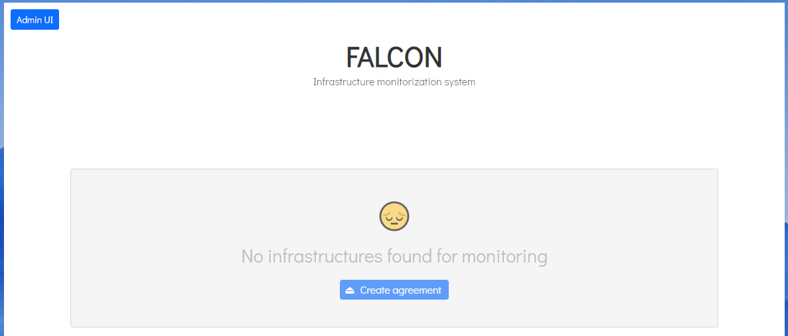
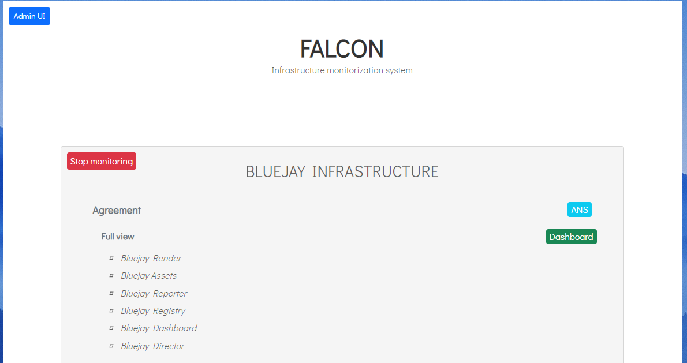
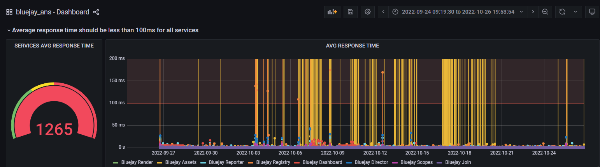

## Auditing external infrastructures «Falcon» 

### Introduction
Governify platform can be use to audit infrastructure metrics based on *SLAs*. We have integrated Prometheus in order to scrape different metrics from external infrastructure.

We call this system **Falcon**, an open source extensible platform that can connect to other infrastructures to collect Prometheus metrics that can be used to audit those systems based on *Service Level Agreements (SLA)*.

You can deploy Falcon in 5 minutes.
___
### Deploying Falcon using Docker-Compose
This guide deploys falcon with the docker ecosystem and serve it by means of an nginx proxy.

#### Prerequisites
- Linux server with the following installed packages:
   - git
   - docker
   - docker-compose (version 1.27 or greater)
- A domain with the ability to modify DNS records.
- Ports 80, 443 open on the server. 

#### Infrastructure setup
1. Create the following DNS A records, pointing to your server IP. If you are deploying locally you can add these to your hosts file pointing to your machine but it only will be accessible by you.
- ui.falcon.*[YourDomain]*
- registry.falcon.*[YourDomain]*
- reporter.falcon.*[YourDomain]*
- dashboard.falcon.*[YourDomain]*
- assets.falcon.*[YourDomain]*
- director.falcon.*[YourDomain]*

2. Clone latest release of Falcon Infrastructure repository [Falcon Infrastructure](https://github.com/governify/falcon-infrastructure):
```
git clone https://github.com/governify/falcon-infrastructure.git
 ```

3. Create a `.env` at the root of the folder. This file contains all the environmental variables for the system to work as intended. Bear in mind that both *SERVICES_PREFIX* and *DNS_SUFIX* must start with a dot and end without it.

```
# GENERAL (Mandatory for deployment)
SERVICES_PREFIX=                    # Ex: .bluejay
DNS_SUFFIX=                         # Ex: .bluejay
SERVER_IP=                          # Ex: .bluejay

# CREDENTIALS
LOGIN_USER=governify-admin         # UI Access user
LOGIN_PASSWORD=governify-project   # UI Access pass

# INFRASTRUCTURE (No need to modify)
GOV_INFRASTRUCTURE=http://falcon-assets-manager/api/v1/public/infrastructure.yaml
ASSETS_GOV_INFRASTRUCTURE=/home/project/public/infrastructure.yaml
ASSETS_REPOSITORY_BRANCH=main
INFLUX_URL=http://falcon-influx-reporter:8086
NODE_ENV=production

# COMPOSE CONFIG
COMPOSE_HTTP_TIMEOUT=200                    # No need to modify

# ASSETS MANAGER
KEY_ASSETS_MANAGER_PRIVATE={{RANDOM_KEY1}}  # No need to modify
```

4. Deploy the system with the following command:
```
./utils/deploy.sh
```

5. (Optional) When the deployment is done, create the SSL certificates for your deployment using [Lets Encript](https://letsencrypt.org/):
```
./utils/init-letsencrypt.sh
```

Governify ecosystem with falcon services should have been deployed in your machine. The following section will guide you through the system.

<Info>If you prefer, there is also an <a href="#advancedsetup">advanced guide</a> to deploy the system including extra options.</Info>

___

### Deploying Falcon using Kubernetes (HELM)

1. Create Namespace
```
$    kubectl create namespace governify-falcon
```

2. Install Contour
```
$    kubectl apply -f https://projectcontour.io/quickstart/contour.yaml
```

3. Wait a few minutes and get the Load Balancer IP Address
```
$    (kubectl get -n projectcontour service envoy -o json) | jq -r '.status.loadBalancer.ingress[0].ip'
```

4. Install CertManager
```
$    kubectl apply -f https://github.com/jetstack/cert-manager/releases/download/v1.1.0/cert-manager.yaml
```

5. Create a values.yaml file with the following content
```
    global:
        node_env: production
        gov_infrastructure: http://falcon-assets-manager/api/v1/public/infrastructure.yaml
        services_prefix: .<infrastructure-prefix>
        dns_suffix: .<your-DNS-zone>
        login_user: governify-admin
        login_password: governify-project
    
    assets_manager:
        private_key: somerandomkey
```

6. Install charts
```
$    helm repo add governify https://governify.github.io/helm-charts
$    helm repo update
$    helm install -f values.yaml falcon governify/Governify-Falcon
```

More information about the configuration options available for Governify-Falcon HELM chart can be found at our [HELM Charts repository](https://github.com/governify/helm-charts/tree/main/infrastructure/Governify-Falcon).
___

### Quick tour
The main interaface is accesible from ui.falcon.*[YourDomain]*
The default credentials for this interface are: 
 * User: governify-admin 
 * Password: governify-project

<Info>This credentials can be changed in the .env file.</Info>

In this interface you should be able to see the infrastructures that are being monitored. At first, it will display a card showing a message .



To start monitoring any infrastructure, check the [adding infrastructures](./auditing-infrastructures/adding-infrastructures.md) section. After setting up the configuration for one infrastructure, you should see a card displayed in the user interface at ui.falcon.*[YourDomain]*.



After clicking the *ANS* button, a new tab will open and the SLA view of the project should appear. It contains information about the infrastucture being monitored along the guarantees and metrics in use.


To calculate data for this infrastructure, the top-right blue button `Calculate Metrics` has to be clicked. A window will pop-up asking for confirmation, since the previous records will be deleted.

Note that Falcon is intended for monitoring and thus, the automatic computation is more suitable in this case. It is strongly recommended to leave automatic computation turned on in case you want to continously keep records of your infrastructure's metrics.

Clicking the `Dashboard` green button at the top-right corner, a new tab will open. The default username and password are governify-admin and governify-project.

<Info>This credentials can be changed, once logged, going to the icon in the bottom left part of the Dashboard, clicking on preferences, and accessing the section Change password at the top of the page.</Info>

Once logged, the dashboard for the project will be opened where all the audit data can be viewed.



Now is time to configure your own projects in order to audit them.
___

### Advanced Setup
This is a guided setup wizard with extra options to deploy the system. 

#### Requirements
- Linux server with yum package installer or with the following packages already preinstalled:
   - git
   - docker
   - docker-compose (version 1.27 or greater)
- A domain with the ability to modify DNS records.
- Ports 80, 443 open on the server. 

#### Advanced infrastructure deploy
Clone latest release of Falcon Infrastructure repository [Falcon Infrastructure](https://github.com/governify/falcon-infrastructure):
```
git clone https://github.com/governify/falcon-infrastructure.git
 ```

Now, open a terminal in the root folder and execute setupAdvanced.sh script:
```
./setupAdvanced.sh 
```


You have to enter 1 and press enter in order to go to the configuration menu.

You should now follow the steps in order to accomplish the system deployment. This are the different options:


    
1. (Optional) Docker and Docker Compose installation (yum/AWS) - When used it installs all the needed tools for the system to function  using yum package manager.

2. Environment variables setup - It opens with `nano` the file .env to enter the different environment variables the system needs to function properly. 

<Info>The first three variables are mandatory for the system to be deployed. If you also want to set up the default tokens for the different APIs you can do it now but is not necessary yet.</Info>

3. (Optional) Automatic DNS records generation (DynaHosting) - In case you have a Dyna Hosting account, you can generate DNS records using this option. When used you will be prompted to enter user and password and it will automatically create them using the domain entered previously in the .env file. If you prefer you can create your DNS records on your own using your provider.

```
- ui.falcon.*[YourDomain]*
- registry.falcon.*[YourDomain]*
- reporter.falcon.*[YourDomain]*
- dashboard.falcon.*[YourDomain]*
- assets.falcon.*[YourDomain]*
- director.falcon.*[YourDomain]*
```

4. System deployment - This option will pull the docker images and deploy the system. It will ask if you want to instantiate an nginx in the system to work as a reverse proxy. In case you want to use an existing reverse proxy in your machine you can disable it.

5. (Optional) Lets-encrypt automatic certificates generation - It automatically generates free SSL certificates using [Let's Encript](https://letsencrypt.org/) authority.

Now you can go to the [quick tour](#quicktour) to see how the system works.